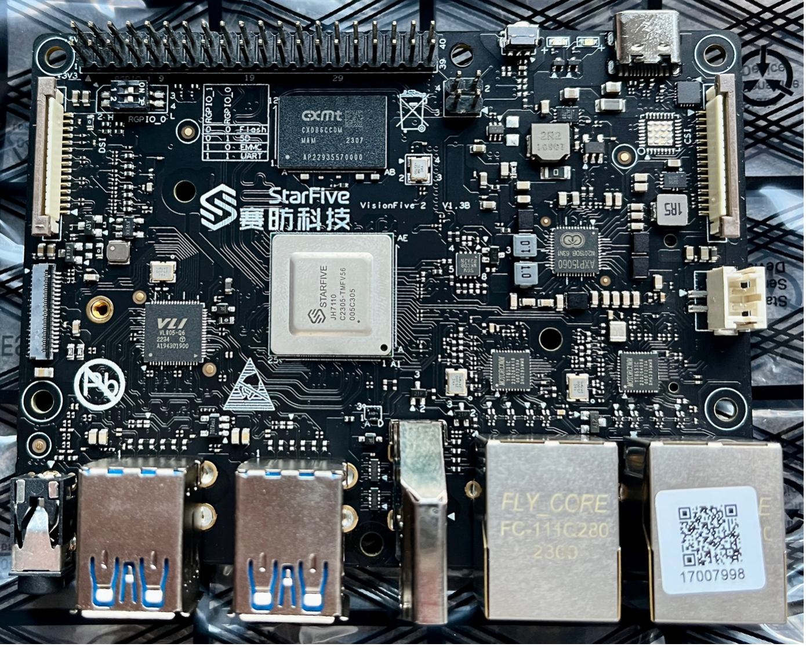
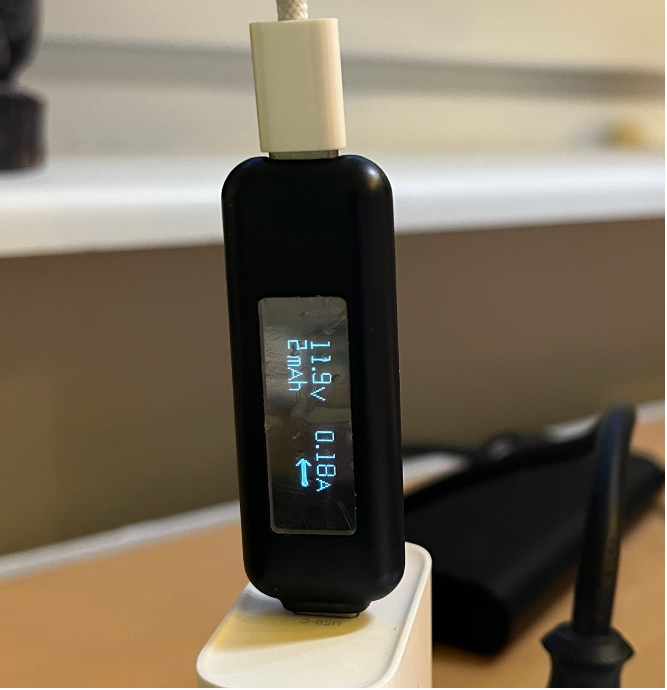

# Debian Trixie Standard Installation for StarFive VisionFive 2 Board

<p align="center">
    
</p>


## Abstract
Debian Trixie supports most parts of the VisionFive 2 board with the standard riscv64 distribtuion kernel, but the Debian installer cannot be diretly used with the VisionFive2 board. It seems to work with some tweaking, but this Repository shows a different way:
* It creates SD Image with the OS wich can be written to an SD card. It should work out-of-the-box with the the latest U-Boot Firmware of the VisionFive 2 board, at least with my board it was possible. If you have a board with an older Firmware there are instructions in the "VisionFive 2 Single Board Computer quick start guide" how to update the Firmware.
It is also possible to install U-Boot SPL and U-Boot Firmware on the partitions 0 and 1 of the SD card image and set the Dip Switches on the VisionFive 2 to SD Card boot. Than the VisionFive2 loads the matching Firmware from SD Card at every boot.

* The SD Image can be written to a SD Card with at least 4GB size with either the DD command or specialized programs like Balena Etcher in Windows. It is recommended to use an SD Card with at least 8GB.

* The Image can also directly be written on an NVMe SSD or eMMC Flash, it does not contain hard coded device names (like /dev/mmcblk0p4), so it can boot form every suitable boot device

* During the first boot the the Root file system is automatically resized to span the full device. 


### Debian Upstream Status

For the latest upstream status of the VisionFive 2 board in the DabianLinux kernel, see the [https://wiki.debian.org/InstallingDebianOn/StarFive/VisionFiveV2](https://wiki.debian.org/InstallingDebianOn/StarFive/VisionFiveV2).

Currently the Kernel supports everything which is needed for "headless" operation as e.g. mini server.

* PCIe (including NVMe and the onboard VL805 PCIe xHCI USB Controller)
* USB 3.0
* Both Onboard Gigabit Ethernet Ports
* libsensor support for the SoC Thermal Sensors
* CPU frequency scaling


## Principle of operation
This repository is a collection of scripts which allow an almost automatic creation of an SD Card Image for the VisionFive2 board (the image can also be run on QEMU and should also work on other Boards supported by the Debian Kernel). It would also be possible to create one script which runs all steps automatically, but the modular approach allows easier manual changes and adoptions during the setup process. 

### Project Directory Structure
The project directory structure is as follows:

```

├── bootstrap.sh
├── env.sh
├── mnt
│   ├── bootfs
│   └── rootfs
├── prepare.sh
├── readme.md
├── remount.sh
├── riscv64_setup.sh
├── run
│   
├── run_qemu.sh
├── setupfs.sh
└── template
    ├── 99-cpufreq.rules
    ├── fstab
    ├── resize-rootfs.service
    ├── resize-rootfs.sh
    └── uEnv.txt
```

The dircetory run will contain the output artefacts, currently the created SD-Card image as sdcard.img, and a temporary scripts used during the process.

In mnt there are mountpoints for the root and boot partition of the SD-Card image, they are mounted as Linux loop devices. 

### How it works
The main building blocks for the Image creaion are 

 * A loop device to load mount the partitions on the SD-Card image like a real disk
 * The mmdebstrab Tool from Debian
 * QEMU User-Mode and  ELF interpreter to run RISC-V binaries transparently on an Intel/AMD/ARM Hostsystem
 * systemd-nspawn to run a chroot lightweigt container on the mounted SD-Card image

 The combaination of QEMU und systemd-nspwan creates an containrzed environment on the SD-Card Image which almost works as an RISC-V userland. 

 In most cases mmdebstrap is used to create an Debian Userland in a subdirectory of the host filesystem. My scripts directly run on the mounted SD image, this saves the need to copy over everything later and also keeps the host system clean, everything resides only in the SD-card image.

 ### Parition structure of the SD-Card Image  

```text
Disk /dev/loop0: 4 GiB, 4294967296 bytes, 8388608 sectors
Units: sectors of 1 * 512 = 512 bytes
Sector size (logical/physical): 512 bytes / 512 bytes
I/O size (minimum/optimal): 512 bytes / 512 bytes
Disklabel type: gpt
Disk identifier: A0440AF5-88DD-4971-83EF-55F928E7D0BF

Device        Start     End Sectors  Size Type
/dev/loop0p1   4096    8191    4096    2M HiFive BBL
/dev/loop0p2   8192   16383    8192    4M HiFive FSBL
/dev/loop0p3  16384  630783  614400  300M EFI System
/dev/loop0p4 630784 8388574 7757791  3.7G Linux filesystem
```

The first two partitions are empty by default, but can be filled with the VisionFive fimrware. When the DIP switches and the board are set to boot from SD-Card the First Stage Boot Loader will load the firmware form here instead of the internal NOR Flash of the VisionFIve 2.

THe EFI System partition is marked as such, but currently not a true EFI parition. It is simply a fat parition containing the Linux Kernel, the initrd image and the device tree files. In further parts of this document the parition is mentioned as "boot partition".

The last parition (4) contains the root filesystem. This parition will be automatically resized to the total size of SD-Card (or NVME disk) during the first boot.

### Structure of the boot partition
The boot partition will be created with the following layout:

```text
├── dtbs
│   └── 6.12.35+deb13-riscv64
│       ├── allwinner
│       ├── canaan
│       ├── microchip
│       ├── sifive
│       ├── sophgo
│       ├── starfive
│       └── thead
├── extlinux
│   └── extlinux.conf
├── config-6.12.35+deb13-riscv64
├── initrd.img-6.12.35+deb13-riscv64
├── System.map-6.12.35+deb13-riscv64
├── uEnv.txt
└── vmlinux-6.12.35+deb13-riscv64
```

The exact number of the kernel version deoends on the point-in-time when the script is run.
The dtbs directories contain all the Device Tree Blobs for the different version of the supported RISC-V boards, the picture above only lists the dtb directories, they contain several files.

```
starfive/
├── jh7100-beaglev-starlight.dtb
├── jh7100-starfive-visionfive-v1.dtb
├── jh7110-milkv-mars.dtb
├── jh7110-pine64-star64.dtb
├── jh7110-starfive-visionfive-2-v1.2a.dtb
└── jh7110-starfive-visionfive-2-v1.3b.dtb
```


## Script Flow

### Prepare
The script  ``./prepare.sh`` contains just the install command to install all  depedencies which are required to run the other scripts. 

### Setup the Disk image and file system
The script ``./setupfs.sh`` creates the SD-Card Image (currently hard-coded  size of 4GB) in run/sdcard.img with the four paritions as outlined above. It sets up a loop device and mount the boot and the root partition in the mnt sub directory.


### Bootstrap Debian into the Disk Image
``./bootsrap.sh`` is the core installation script. It runs runs mmdebstrap on mnt/rootfs (the mount point of the root partition of the SD-Card image), copies some files from the template subdirectory to the right places on the root files system and in then runs the  script ``rsicv64_setup.sh`` inside a RISC-V container created with systemd-nspawn. 
During the bootstrap process it remounts the boot partition form mnt/bootfs to mnt/rootfs/boot, which is the place where the /boot parition is later also mounted in the running Linux system. This ensures that the kernel image (which is installed during ``rsicv64_setup.sh``), the initrd, the device tree files and the U-Boot menu are created automatically in the correct place. It is especially important for the u-boot-update command, because it dynamically checks if /boot is a directory our an mount-point and changes its behaviour accordingly. 

#### Properties of the generatded image
* Hostname is hard-coded to **starfive** (can be changed in ``riscv64_setup.sh``)
* A user **debian** with password **debian** is created and added to the sudo group
It uses network-manager for managing the network interfaces
* SSH is installed and activated
* Tools like usbutils, htop, net-tools, smartmontools, Midnight Commander (mc), git are installed (for a complete list take a look into ``riscv64_setup.sh``)
* libsensors and lm-senors are installed, with the ``sensors``command the temperature of the CPU and NVMe SSD kan be shown
* The system sets the CPU frequency governor ``schedutil`` during boot, wich allows the CPU clock to dynamically scale in the steps 375, 500, 750 and 1500 Mhz - this keeps the CPU cooler than the default ``performance`` governor


### Unmount and clean
``run/umountfs` is a script created by ``setup.fs`` or ``remount.sh``do clean up, it will remove the mounts and the loop device. It is strongly advised to run this script before doing further steps with the image, like copying it to a real mediium or running it in QEMU.

### Copy to a medium
The image can be copied to an SD-Card, or alo eMMC or NVMe Flash devices. There are several possbilties to achieve this. In Linux often dd is the easiest way:
```sh
sudo dd if=run/sdcard.img of=/dev/sdX bs=4M status=progress conv=fsync
```
Replace `/dev/sdX` with the actual device name of your SD card (e.g., `/dev/sdb`). Double-check the device name to avoid overwriting the wrong disk.

Many Linux Desktop enviroments automatically mount an SD Card when it is inserted, in this case you need to unmount it, e.g. with the eject button in the Desktop File manager. SD Cards can be mounted in several ways, so there is no one-and-only way.

#### Hint for VM users
When you run the Scripts in a Linux VM on e.g. Windows or macOS it can be difficult to mount the SD card in the VM. Usually USB based SD Card readers can be assigned to the VM in Desktop Hypervisors like VMWare or UTM (Mac), but on board PCIe based SD-Card readers cannot be assigned. In this case it is best to copy the image to the Host enviornment and use a Host OS tool like Balena Etcher.

#### Hint for installing the Image to an NVMe SSD
There are two easy possiblties to install the IMage to an NVMe SSD:

* Use an USB NVMe Adapter
    + Install the SSD  temporarly into an USB case, connect it to the Host system and copy the Image to it in the same way as described for SD Cards
    + Remove the SSD from the USB case and install it into the VisionFive 2 board
    + Startup the board with out an SD Card inserted. It should boot from the NVMe automatically.

* Install to the NVMe natively on the VisionFive 2 (recommended)
    + Boot the VisionFive 2 board from an SD Card (which is strongly advised for a first time anyway).
    + Ensure that an already built-in SSD is detected with `lspci` and `lsblk` commands:
    ```
    debian@starfive:~$ lspci -tv
    -[0000:00]---00.0-[01]----00.0  VIA Technologies, Inc. VL805/806 xHCI USB 3.0 Controller
    -[0001:00]---00.0-[01]----00.0  ADATA Technology Co., Ltd. XPG SX8200 Pro PCIe Gen3x4 M.2 2280 Solid State Drive
    debian@starfive:~$ lsblk
    NAME        MAJ:MIN RM   SIZE RO TYPE MOUNTPOINTS
    nvme0n1     259:0    0 476.9G  0 disk 
    debian@starfive:~$ 
    ```
    (A SSD with already partitions on it will show the paitition devices (nvne0n1pX) in lsblk)
    + Copy the SD Image with e.g. FTP/SFTP/ etc. as file to the SD Card (when you have at least an 8GB SD Card there is enough space).
    + Install the Image to the NVMe SSD with dd e.g:
    ```sh
    sudo dd if=run/sdcard.img of=/dev/nvme0n1 bs=4M status=progress conv=fsync
    ```
    Beware: This will overwrite anything on your SSD !!
    + Shutdown the Board: ```sudo poweroff```
    + Remove the SD Card
    + Restart (power cycle or reset button )

Of course you can also install the NVMe SSD temporarly on a free SSD slot of your PCs mainboard, but this is a lot of work when you want do it more than once. The "self hosted" method to just copy the image to the NVMe SSD natively on the VisionFive is very convenient.

#### Stabilty of NVMe Disks on the VisionFive 2

There has been reports in the Internet that NVMe Disks do not work stable on the VisionFive 2 and the problems seem to be related to the Power Supply. I'm using my VisionFive 2 with an older ADATA 8200XP 512GB SSD, and had no problems so far. Most people reoprting problems tried to use 5V power supplies only. But the VisionFive 2 supports USB-PD (Power Delivery) and automatically uses higher input voltages when the Power Supply offers them. I made very good experience with 20W USB-PD chargers from UGREEN and Apple (the charger from my iPad, but I think the brand doesn't matter), the Board negotiates 12V with my supply:

<p align="center">
    
</p>
